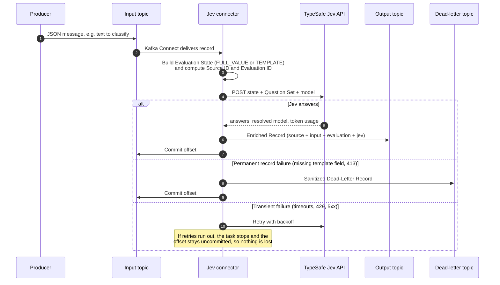

# Kafka Jev Connector

Ask questions about your Kafka messages with an AI model, and get the answers back as Kafka messages.

`kafka-jev-connector` is a Kafka Connect sink connector. It reads records from your input
topics, sends each one to [TypeSafe AI's Jev](https://typesafe.ai) service along with a
set of questions you define, and publishes an **Enriched Record** to an output topic. That
record holds the original message, the answers from Jev, and the evidence needed to trace
and deduplicate each evaluation.

Typical uses: classifying support tickets, scoring sentiment or tone, routing messages to
teams, or flagging content, all without writing a consumer service.

| | |
| --- | --- |
| **Runtime** | Kafka Connect 4.2, Java 17 |
| **Target platform** | Confluent Cloud managed custom connectors (also runs on self-managed Connect) |
| **Delivery** | At least once, with deterministic Source IDs and Evaluation IDs for deduplication |
| **Failures** | Bad records go to a dead-letter topic; transient failures retry and are never silently dropped |

## How it works



1. A producer writes a message to an input topic.
2. The connector turns the message into **Evaluation State**: either the whole value
   (`state.mode=FULL_VALUE`) or a text template with only the fields you allow
   (`state.mode=TEMPLATE`).
3. It sends that state to Jev together with your **Question Set** (`jev.questions`).
4. On success it publishes an Enriched Record to `output.topic`. On a permanent,
   record-specific error it publishes a sanitized record to `errors.deadletter.topic`.
5. The input offset is committed only after the result is written.

## Quick start

You need:

- A Kafka cluster with Kafka Connect 4.2 (Confluent Cloud custom connectors or a
  self-managed worker)
- A TypeSafe AI API key
- The plugin ZIP, `kafka-jev-connector-<version>-plugin.zip`. To build it, run
  `mvn package` and pick it up from `target/` (see [DEVELOPMENT.md](DEVELOPMENT.md)).

The steps below use Confluent Cloud.

1. **Create the topics.** The connector never creates topics. You need an input topic,
   an output topic, and a dead-letter topic, all distinct.
2. **Upload the plugin.** In Confluent Cloud, go to **Artifacts → Custom connectors**
   and upload the plugin ZIP. Select runtime `4.2` and Java `17`.
3. **Allow egress** to `api.typesafe.ai:443`.
4. **Create the connector** with a configuration like this one:

   ```jsonc
   {
     // Connector implementation class
     "connector.class": "io.github.smatiolids.kafkajev.JevSinkConnector",
     // Number of parallel tasks
     "tasks.max": "1",
     // Input topic(s) to evaluate, comma-separated
     "topics": "messages",
     // Read record keys as plain strings
     "key.converter": "org.apache.kafka.connect.storage.StringConverter",
     // Read record values as JSON
     "value.converter": "org.apache.kafka.connect.json.JsonConverter",
     // Values are plain JSON, without an embedded schema
     "value.converter.schemas.enable": "false",
     // Topic for Enriched Records
     "output.topic": "message_jev",
     // Topic for records that fail permanently
     "errors.deadletter.topic": "message_jev_dlq",
     // Kafka API key and secret, used to read input and write output
     "kafka.api.key": "<kafka-api-key>",
     "kafka.api.secret": "<kafka-api-secret>",
     // TypeSafe AI API key
     "jev.api.key": "<typesafe-api-key>",
     // Jev model: an alias like jev-latest, or a pinned version like jev-1.13.0
     "jev.model": "jev-latest",
     // Name and version of the Question Set; change it whenever the questions change
     "question.set.id": "message_classification/v1",
     // The questions to ask Jev, as a JSON string
     "jev.questions": "{\"friendly\":{\"type\":\"score\",\"instructions\":\"How friendly is the message?\",\"criteria\":[\"defined as a score from 0 to 10, where 0 is 'not friendly at all' and 10 is 'extremely friendly'\",\"neither friendly nor unfriendly\",\"somewhat friendly\",\"very friendly\"]}}",
     // Send the whole message value to Jev (TEMPLATE sends only selected fields)
     "state.mode": "FULL_VALUE",
     // Skip tombstone (null-value) records
     "behavior.on.null.values": "IGNORE"
   }
   ```

   The comments are for reading only. Remove them before you submit the configuration,
   because JSON doesn't allow comments.

   Keep secrets out of source control. In production, pin a model version such as
   `jev-1.13.0` instead of `jev-latest`, and consider `TEMPLATE` mode so only
   approved fields leave your cluster.

5. **Send a message** and read the output topic (see the example below).

[SETUP.md](SETUP.md) has the full walkthrough: service-account permissions, networking,
Schema Registry formats, and verification steps. For a self-managed worker, unpack the
ZIP into the worker's `plugin.path` and register the same configuration through the
Connect REST API, replacing `kafka.api.key`/`kafka.api.secret` with
`output.bootstrap.servers` for an unauthenticated cluster.

## Example

With the configuration above, the Question Set asks one question, `friendly`, scored on
four levels.

### Input

A producer sends this value to the `messages` topic with key
`ca93e77c-6f1e-4c79-9c6f-edd93bd8aced`:

```json
{"text": "I';m mad at you"}
```

Any Kafka producer works. With Python and `confluent-kafka`:

```python
import json, uuid
from confluent_kafka import Producer

producer = Producer({
    "bootstrap.servers": "<bootstrap-servers>",
    "security.protocol": "SASL_SSL",
    "sasl.mechanisms": "PLAIN",
    "sasl.username": "<kafka-api-key>",
    "sasl.password": "<kafka-api-secret>",
})
producer.produce("messages", json.dumps({"text": "I';m mad at you"}), key=str(uuid.uuid4()))
producer.flush(10)
```

### Output

About three seconds later, this Enriched Record appears on `message_jev`:

```json
{
  "source": {
    "id": "sha256:a0090ce3472317882d2882e0e6d255083e37039a13e07dcda2fb25a21580d64a",
    "topic": "messages",
    "partition": 0,
    "offset": 4,
    "timestamp": "2026-10-02T20:01:35.520Z",
    "key": "ca93e77c-6f1e-4c79-9c6f-edd93bd8aced"
  },
  "input": {
    "text": "I';m mad at you"
  },
  "evaluation": {
    "id": "sha256:465c7632733d48b4f28d4aecdf68498bed1100ba5570382c9e2418e5807abfc9",
    "question_set": {
      "id": "message_classification/v1",
      "hash": "sha256:cb7e76d8c75ec91d65a322dfe7e933ec4b98f420ed73f355bcfee3284fea65dc"
    },
    "state_policy": {
      "mode": "FULL_VALUE",
      "hash": "sha256:73610c3a5bebbe3c5cce82d0621f0d4c65b2a73a78a14e5bbdbd311add1915fa"
    },
    "state": {
      "hash": "sha256:5002966feb10ee2313a9c96b8b8235bbe468c2c766723ee107d92b56b0e8937e"
    },
    "model": {
      "requested": "jev-latest",
      "resolved": "jev-1.13.0"
    },
    "attempt_count": 1,
    "duration_ms": 596,
    "completed_at": "2026-10-02T20:01:38.361718801Z"
  },
  "connector": {
    "name": "jev-techzone",
    "plugin": "kafka-jev-connector",
    "version": "1.0.0"
  },
  "jev": {
    "model": "jev-1.13.0",
    "answers": {
      "friendly": {
        "type": "score",
        "score": 0.08,
        "confidence": 0.92,
        "legend": {
          "0": "defined as a score from 0 to 10, where 0 is 'not friendly at all' and 10 is 'extremely friendly'",
          "1": "neither friendly nor unfriendly",
          "2": "somewhat friendly",
          "3": "very friendly"
        },
        "probabilities": {
          "0": 0.93,
          "1": 0.07,
          "2": 0,
          "3": 0
        }
      }
    },
    "usage": {
      "input_tokens": 354,
      "output_tokens": 17
    }
  }
}
```

### Reading the result

| Section | What it tells you |
| --- | --- |
| `source` | Where the message came from. `source.id` is a stable hash of topic, partition, and offset. |
| `input` | The original message value, unchanged. |
| `evaluation` | How the answer was produced: Question Set and state hashes, requested vs. resolved model, attempts, and latency. `evaluation.id` is the key to deduplicate on. |
| `connector` | Which connector instance and plugin version wrote the record. |
| `jev` | The Jev response, embedded unchanged. |

Here Jev judged the message **not friendly**: level `0` has probability `0.93`, giving an
overall score of `0.08` with confidence `0.92`. The alias `jev-latest` resolved to
`jev-1.13.0`, and the call took 596 ms on the first attempt.

Each Enriched Record also carries two headers, `kafka-jev-evaluation-id` and
`kafka-jev-resolved-model`, so consumers can route or deduplicate without parsing the body.

## Good to know

- **Duplicates are possible.** Delivery is at least once. If downstream effects must
  happen once, deduplicate by `evaluation.id`.
- **Question Sets are immutable.** When you change `jev.questions`, also change
  `question.set.id` (for example `.../v2`).
- **Data leaves your cluster.** Evaluation State is sent to TypeSafe AI. Use `TEMPLATE`
  mode to send only approved fields, and review TypeSafe's data-processing terms first.
- **Secrets stay out of output.** The connector does not log payloads or Evaluation
  State, and it never writes credentials to output or dead-letter records.

## Documentation

- [SETUP.md](SETUP.md): Confluent Cloud deployment in detail
- [Connector Configuration](docs/configuration.md): every configuration property
- [Record Contracts](docs/record-contracts.md): Enriched and Dead-Letter Record shapes,
  hashing, and templates
- [CONTEXT.md](CONTEXT.md): domain glossary
- [DEVELOPMENT.md](DEVELOPMENT.md): building, testing, and contributing

## License

Apache-2.0. See [LICENSE](LICENSE) and [NOTICE](NOTICE).

This independent project is not affiliated with or endorsed by TypeSafe AI or Confluent.
